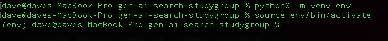
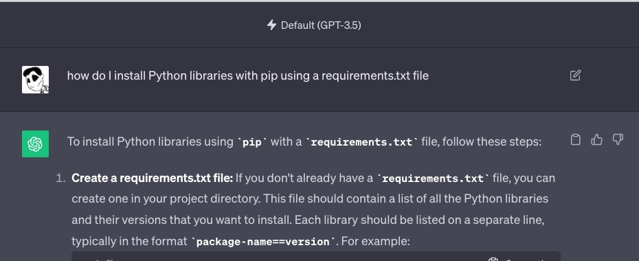

# Week 1

## Learning Objectives

* Setup Python on your dev laptop
* Setup an Open Source IDE - Visual Studio Code
* Learn to use Python virtual environments
* Learn to use pip to import libraries and work with requirements files
* Working with a secrets file to keep passwords out of your source code

## Step 0 - make a copy of this repo

You could download this whole project as a zip ... but you might as well make sure you have git installed on your laptop and do it the real way

```bash
cd parent_directory_you_want_to_download
git clone https://github.com/derickson/gen-ai-search-studygroup.git
cd gen-ai-search-studygroup
```

## Step 1 - get python 3.9 or 3.10 

Python is an interpreted scripting language popular in the data science world.  While it's built in C++, the Python interpreter does all of its work at run-time, and doesn't typically pre-compile your code.  Like all coding languages, it comes with a lot of upfront work and understanding with regards to using 3rd party code libraries, package repositories, and dependency management.


Macs come with Python preinstalled, but sometimes it's an older version.  Coding Python on Windows works just fine but often requires you to customize your code to work with the different file systems and command line environments from Mac and Linux.  Often people with Windows machines will set up a Linux VM for development rather than having to translate the 99% of code samples out on the web to Windows.  It's up to you.

Either way, your first goal is to get Python working locally.  You are going to want Python 3.9 or 3.10 for maximum compatibility with the ML world.  Install Python and make sure it is the version of Python on your PATH. That means that when you type ```python --version``` or ```python3 --version``` into your shell you get something like this

```bash
% python3 --version
Python 3.9.12
% which python3
/Library/Frameworks/Python.framework/Versions/3.9/bin/python3
```

You can have multiple versions of Python installed at the same time, they'll just show up in different paths. We'll learn how to pick which version is used for a project later.

## Step 2 - Install Visual Studio Code 

You need a real IDE.  There are plenty of good ones out there. Visual Studio Code is a platform and a good pick if you don't already have a favorite.

https://code.visualstudio.com/

Install it and get it to the point where you can execute the simple test script in this directory by hitting the play button in the upper right.  This might involve you needing to follow some prompts from Visual Studio Code to set up Python plugins and extensions.


Another huge time saver ... install the Visual Studio Code command line tools

https://stackoverflow.com/questions/29971053/how-to-open-visual-studio-code-from-the-command-line-on-osx 

They'll let you launch a whole directory as a project from the terminal by typing something like:

```bash
% cd gen-ai-search-studygroup
% code .
```

## Step 3 Use a Python virtual environment

By default, when you start installing libraries into your Python environment they'll go to the global folder for the Python install. This is a huge problem once you are working on different projects that need different versions of libraries for compatibility reasons.  For this reason, per-project you are going to create a "virtual environment" to keep everything isolated.

From the command line in the root directory of this repo do the following. Substitute ```python``` for ```python3``` if that's the command you use on your machine

```bash
python3 -m venv env
```

this uses the virtual environment module of Python to create a virtual environment in a new folder called env.

Make sure your .gitignore file has an entry for env so you don't check in anything from this folder .

Tell your terminal to start working with this Python environment with the following command

```bash
source env/bin/activate
```



Notice that the command line gets a ```(env)``` put at the start of it to let you know it's in a virtual environment.  You can use this virtual environment the same way from within your Visual Studio Code by opening a new terminal and using the activate command.  Launching Visual Studio from with ```code .``` from a terminal that is using a virtual environment will do some of these extra steps for you.  

With this done, from here on out any terminal or tool using these environments will install and use libraries from the env first rather than global saving us lots of frustration with incompatible versions of libraries.

When you are done and don't want to use a virtual environment anymore, close the terminal or use the deactivate command

```bash
deactivate
```

If you have multiple versions of Python installed on your machine and you want your Python environment to use a specific version read the following to learn how that works

https://stackoverflow.com/questions/1534210/use-different-python-version-with-virtualenv


### What about conda?

There is a data science project called conda that does a lot of what venv does package management for multiple languages used in data science, including Python, simultaneously.  If you know what you are doing, by all means, use conda.

## Step 4 - using pip

Once we have activated our Python virtual environment it is now safe to start installing libraries.  Pip comes with Python and is the main package installer.

try the following

```bash
cd gen-ai-search-studygroup
source env/bin/activate
pip install openai
ls env/lib/python3.9/site-packages/openai ## or similar depending on your Python version
```

Instead of going just anywhere, the dependencies for your project stay in that env folder 

You can save a file for the libraries pip has installed for your project using

```bash
pip freeze > requirements.txt
```

Try it and take a look at the file.  The freeze command preserves the exact version of your library so behavior won't change if a new version of the library comes out later.  **Often** open source projects will come with a requriements.txt file for you to use.

Once you've saved the requirements.txt file you don't have to worry about losing your env folder.  The following get you right back where you started:

```bash
rm -rf env ## Obviously be very careful with this command
python3 -m venv env
source env/bin/activate
pip install -r requirements.txt ## get the specific requirements from your file
```

### Side note - use ChatGPT when you can remember how to do something

It really will change the way you code, and reduce the number of things you have to remember



## Work with secrets files

You'll need to work with passwords a lot as you want to access things like Elasticsearch and 3rd party cloud services.  You need to get in the habit of not hard-coding passwords into your source code.  For this study group, we'll use the dotenv library to manage our passwords in a file named ".env" .  The dotenv python library will load the contents of this file which we will **NOT**  never into GitHub into environment variables at the start of our Python code.  This will transition well to when we deploy code in production and need to use another tech like Docker or Kubernetes that assumes you pass in secrets using environment variables.

Create a text file named .env that has the following contents

```txt
MY_SECRET = "I'm always angry"
```

To make sure your Python virtual environment is activated, run the following pip install

```bash
pip install python-dotenv
```

Now create a Python program that looks like the following and run it in your IDE or terminals

```python
## import a python library for working with the OS
import os
## import a specific defined function from the dotenv python library
from dotenv import load_dotenv


#load the environment file
load_dotenv(".env", override=True)

## get the secret from the environment variables
secret = os.environ["MY_SECRET"]

## print a line of text with that secret to standard out
print(f"That's my secret, Cap: {secret}")
```

if you cut and paste the above code into a file called ```app.py``` you can then run with 

```bash
python app.py
```

as long as your environment variables are all set up the printout should have your secret.

If you get an error talking about dotenv or load_dotenv, it means your virtual environment and pip step to install dotenv have not been done correctly.