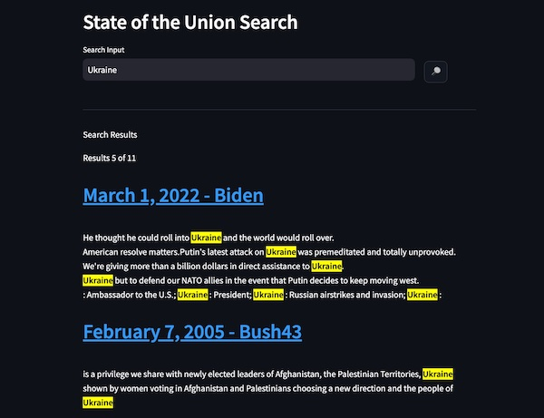

# Week 2

## Learning objectives
* update this repository by doing a git pull
* grabbing some full-text data with a web scrape
* connecting to Elasticsearch using Python
* Using a Python Notebook to index whole documents into Elasticsearch
* Running a teaser of a Streamlit search app

## Step 1 - Getting the latest code

Assuming that the course material for this study group is being updated from time to time, you'll need to learn how to get the latest code without wiping out changes you've made or work you'd like to save.

From the root directory of this project, this is the command to update the code. It will throw an error if you have uncommitted changes. You can save those files somewhere else by copying that week's directory somewhere as a backup and then doing a 'stash' command followed by a pull.  

```bash
git stash
git pull
```

## Step 2 - Getting source data

Making sure our virtual environment at the root directory of the project is active, let's get the Python libraries we'll need for this exercise

```bash
source env/bin/activate
cd class/week02
python3 -m pip install --upgrade pip ## never hurts
pip install beautifulsoup4==4.12.2 elasticsearch==8.10 tqdm==4.66 requests==2.31
```

To get some full-text data to put into Elasticsearch, we are going to do a simple web scrape of the last 30 years of presidential State of the Union addresses from https://www.govinfo.gov/features/state-of-the-union

```bash
python3 get-speeches.py
```

This code will use *requests* to get the HTML from a list of URLs I've prepared and then use BeautifulSoup to convert the HTML to a simple text string.  BeautifulSoup is pretty good at dealing with poorly formed HTML to grab specific parts of websites as long as the actual HTML returned from a web server is the content we want. Dynamic sites require more work because sometimes we need a headless browser to client-side JavaScript to complete the rendering of pages.

The above script saves the retrieved data in a .pickle file, which is a way to take a Python in-memory object and save it to disk with compression.  I've done this so we don't have to scrape more than once.

## Step 3 - Connecting to Elasticsearch

Go ahead and run the test-es-connection.py script, which should fail and print a comment about environment variables.

```bash
python3 test-es-connection.py
```

Use what you learned in Week 1 to create a .env file in this directory with your connection information to a new Elasticsearch server that is Elasticsearch version 8.10 or higher.  Read the test-es-connection.py file to see what environment variables we need to put in our .env file.

When you have it working, the code will print Elasticsearch's tagline "You Know, for Search"


## Step 4 - Let's use a Python Notebook

Open [first_notebook.ipynb](first_notebook.ipynb) in your Visual Studio Code editor.  If this is your first time doing this, you'll need to install a bunch of plugins to visual studio code. The IDE should prompt you.  Once open, you'll need to select a *kernel* in the top right corner of the open Notebook editor.  Select the 'Python Environments' option and pick the virtual environment at the root of this project.

The Python notebook player in Visual Studio code is pretty good, though not as pretty or easy to use as Google Colab. For example ```input()``` commands create a text box at the top of the window instead of inline with output which can be disorienting.

Run the Python code in the notebook to make sure things are working.

## Step 3 - Simple ES Inserts and why you shouldn't do them

Follow the code in [simple_es_insert.ipynb](simple_es_insert.ipynb)

## Step 4 - Streamlit preview

We won't learn how to use Streamlit this week, but let's get the environment going

Install Streamlit, go into the subdirectory in this folder called app, and then launch the Streamlit app.  It assumes that the .env file is in the week02 folder

```bash
pip install streamlit
cd app
streamlit run app.py
```



