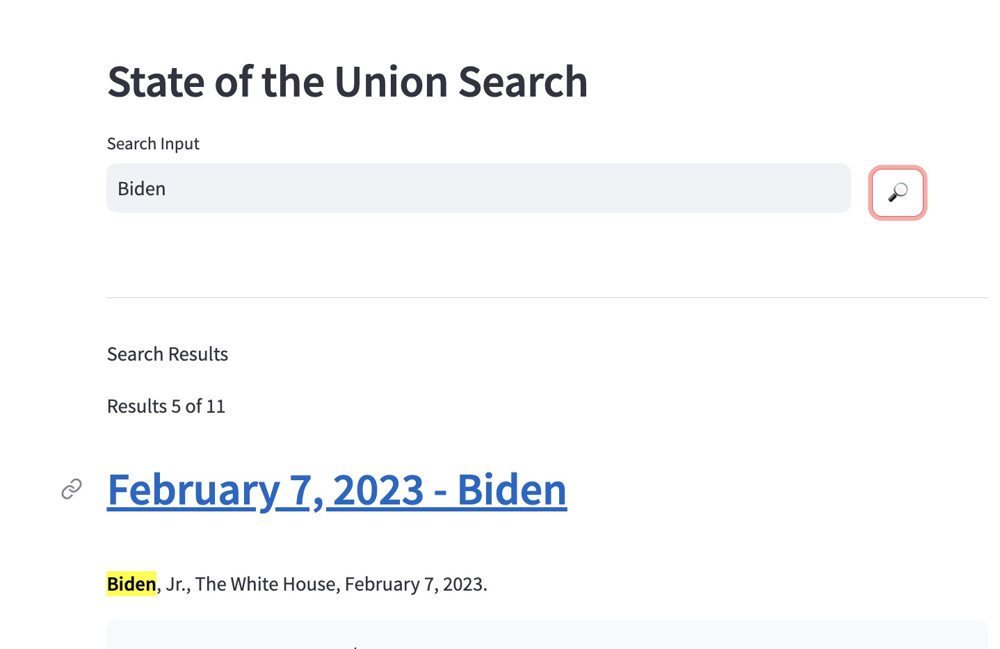
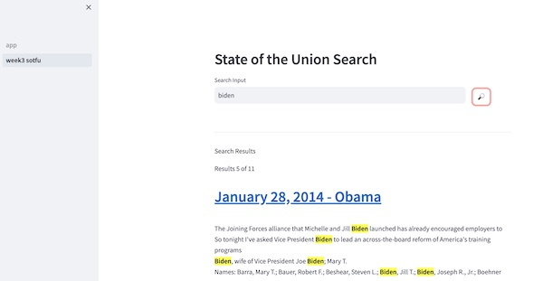
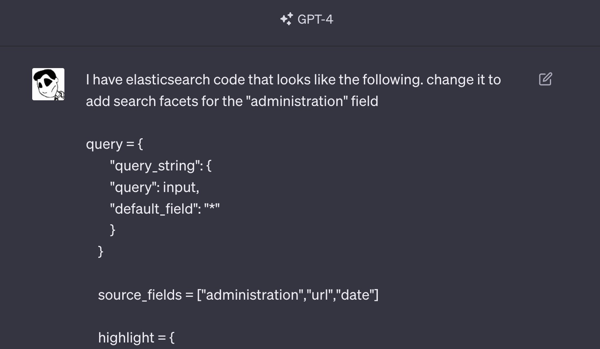
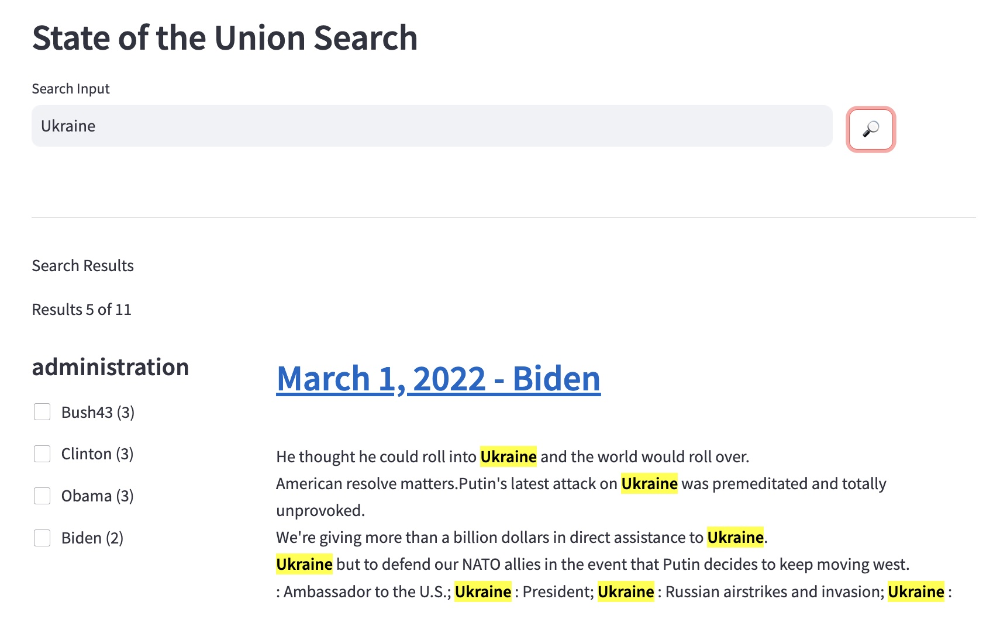

# Week 3

## Learning Objectives

* Get comfortable with basic Streamlit
* Start a multi-page Streamlit app
* Add search facets to our State of the Union App

## Step 1 - Streamlit Getting Started

Go through the Streamlit.io getting started examples. They are pretty good and will teach you some important concepts we'll use right away to organize a modular streamlit project to host search examples.

Do the following ->
 - [ ] [Streamlit Install](https://docs.streamlit.io/library/get-started/installation) - If using Mac/Linux, make sure to pip install into your virtual environment.
 - [ ] [Main concepts](https://docs.streamlit.io/library/get-started/main-concepts)

Going through the above ends with you understanding the following major Streamlit concepts

### App model
* Streamlit apps are Python scripts that run from top to bottom
* Every time a user opens a browser tab pointing to your app, the script is re-executed
* As the script executes, Streamlit draws its output live in a browser
* Scripts use the Streamlit cache to avoid recomputing expensive functions, so updates happen very fast
* Every time a user interacts with a widget, your script is re-executed and the output value of that widget is set to the new value during that run.
* Streamlit apps can contain multiple pages, which are defined in separate .py files in a pages folder.

Keep Going through the rest of the getting started guide ->
- [ ] [Create an App](https://docs.streamlit.io/library/get-started/create-an-app)
- [ ] [Multi-page Apps](https://docs.streamlit.io/library/get-started/multipage-apps)

## Step 2 - Modifying the app from the previous week

Now that we've done the Streamlit tutorial the State of the Union Search app we ran in week 2 : [code link](../week02/app/app.py) isn't that complicated.  
* When the search button is clicked we run the search and put the search response in a session variable
* When the session variable is populated we render some search results
* We HTML escape the data being rendered to the screen to avoid cross site scripting attacks, retoring the ```<strong>``` highlight formatting only. It's unlikely to be a source of an attack here, but we never want to take data from a user or a database and evaluate it as HTML to be rendered by a browser.

Let's use what we've learned to modify the app from last week's exercise.

```bash
## copy last week's code into this folder
## run this from the week03 directory
cp -R ../week02/app .
cp ../week02/.env .
cd app
streamlit run app.py
```

Make sure the .env file is being found and everything is sill working.



## Step 3 - Make this a multi-page app

Move everything in ```app.py``` to a document in a pages subfolder

```bash
mkdir pages
cp app.py pages/week3_sotfu.py 
```

Now edit state of the union to just be a landing page

```python
import streamlit as st

"# Landing Page"
```



## Step 4 - Add query for facets

Notice that the full search result payload is being printed to the terminal. We'll use this to gradually edit the source code of app.py to add Search Facets

Remember, it's 2023 and cheating is allowed. If you get stuck, you can always ask ChatGPT how to do something as long as the tech was being talked about on the we back in 2021.


However! ChatGPT may recommend you to change back to using 7.X stlye Elasticsearch python paramters like "body" and "_source". This isn't necessary.  You just need to start using the aggregations parameter of the .search function.

The documentation for 8.10 (the time of writing this exercise) is here: [Documentation for .search()](https://elasticsearch-py.readthedocs.io/en/v8.10.0/api.html#elasticsearch.Elasticsearch.search)

```python
def runKeywordSearch(input):
    es = get_es()

    query = {
        "query_string": {
        "query": input,
        "default_field": "*"
        }
    }
    aggs = {
        "administration_facets": {
            "terms": {
                "field": "administration" 
            }
        }
    }
    source_fields = ["administration","url","date"]
    highlight = {
        "fields": {"text": {}},
        "pre_tags": ["<strong>"],
        "post_tags": ["</strong>"]
    }
    response = es.search(
        index=index_name, 
        query=query,
        aggregations=aggs,
        source=source_fields,
        highlight=highlight,
        size=size)
    
    print(json_pretty(response.body))

    st.session_state.search_results = response["hits"]
```

Now the search result that prints to the terminal has an aggregations section we'll be able to use to add the UI for search facets.

```json
    "aggregations": {
        "administration_facets": {
            "doc_count_error_upper_bound": 0,
            "sum_other_doc_count": 0,
            "buckets": [
                {
                    "key": "Obama",
                    "doc_count": 8
                },
                {
                    "key": "Biden",
                    "doc_count": 3
                }
            ]
        }
    }
```
## Step 5 - Rendering the Facets

First we'll need some extra space in our UI.  Add the following near the top of your ```app.py``` to put Streamlit's layout into wide mode

```python
st.set_page_config(layout="wide")
```

Up at the top we'll create a new session variable to track the state of facet selections.

```python
if "facet_selections" not in st.session_state:
    st.session_state.facet_selections = {}
```


Next we'll change how we render results so that the facets are to the left of the results list by using columns:

```python
    f"Results {result_count} of {hit_count}"

    r1, r2 = st.columns([1,3])
    with r1:
        aggs = st.session_state.search_aggs if "search_aggs" in st.session_state else {}
        for key in aggs:
            field_name = key.replace("_facets","")
            change_detected = False
            f"#### {field_name}"
            for bucket in aggs[key]["buckets"]:
                facet_value = bucket['key']
                doc_count = bucket['doc_count']
                facet_index = f"{field_name}|{facet_value}"
                
                ## the checkbox
                checkbox = st.checkbox(f"{facet_value} ({doc_count})", key=facet_index)
                ## grab the current value from session state so we can detect change
                cur_val = facet_index in st.session_state.facet_selections and st.session_state.facet_selections[facet_index] 
                ## Based on the value, which may include the user just having changed it, set state and detect change
                if checkbox:
                    st.session_state.facet_selections[facet_index] = True
                    if not cur_val:
                        change_detected = True
                else:
                    st.session_state.facet_selections[facet_index] = False
                    if cur_val:
                        change_detected = True

        if change_detected:            
            runKeywordSearch(keyword_search_box)
            st.rerun()

    with r2:
        for result in results["hits"]:
            url = result["_source"]["url"]
            date = result["_source"]["date"]
            administration = result["_source"]["administration"]
            st.markdown(f"<h2><a href='{url}'>{date} - {administration}</a></h2>",unsafe_allow_html=True)
            html_composite = "<p>"
            for hl in result["highlight"]["text"]:
                html_composite = html_composite + "<br/>" + custom_escape(hl)
            html_composite = html_composite + "</p>"
            st.markdown(html_composite, unsafe_allow_html=True)

```

The actual facets are driven by the aggregations return.
When we detect that a change has occurred vs the most recent sessions state, we re-run the query and then force a page re-load.

We are now rendering the facets.



## Step 6 - Make the facets change the search

Clicking the facets doesn't currently do anything. To have them effect the search we need to build a compound query.  The facet_index we saved into the session state is a delimited value carrying both the field and value sparated by a ```|```

```python
    queries = [{
        "query_string": {
            "query": input,
            "default_field": "*"
        }
    }]

    for key in st.session_state.facet_selections:
        if st.session_state.facet_selections[key]:
            field, value = key.split("|")
            term_query = {"term": {field: value}}
            queries.append(term_query)

    query = {"bool":{"must":queries}}
```

## Step 7 - make sure the search button clears the facet selections

UI design can get complex, so there's more than one way to do this. It's possible to change the search box still have a facet selected. This could lead to the facet being applied to the search but then the UI element for it not being rendered.  We don't want to get stuck unable to reset the facets when we have so many filters applied that there are no hits.

An easy way past this is to build a reset button, or to reset the facet_selections when the search button is hit.

Edit the search button to do the following:

```python
if st.button("🔎", type="secondary", key="searchKeyword"): 
        ""
        st.session_state.facet_selections = {}
        runKeywordSearch(keyword_search_box)
```

## Troubleshooting

When it's done, my code looks like this for comparison

```python
import streamlit as st
import json
from resources import get_es
import html

st.set_page_config(layout="wide")

index_name = "genai_state_of_the_union"
size = 10

if "facet_selections" not in st.session_state:
    st.session_state.facet_selections = {}

st.markdown("""<style>
    strong {
        background-color: #FFFF00; /* Bright Yellow */
        color: #000000; /* Black */
    }
</style>""", unsafe_allow_html=True)


# pretty printing JSON objects
def json_pretty(input_object):
  print(json.dumps(input_object, indent=4))

def custom_escape(text):
    # First, we HTML escape the entire text
    escaped = html.escape(text)
    # Then, we unescape our desired patterns
    escaped = escaped.replace("&lt;strong&gt;", "<strong>")
    escaped = escaped.replace("&lt;/strong&gt;", "</strong>")
    return escaped


def runKeywordSearch(input):
    
    es = get_es()

    queries = [{
        "query_string": {
            "query": input,
            "default_field": "*"
        }
    }]

    for key in st.session_state.facet_selections:
        if st.session_state.facet_selections[key]:
            field, value = key.split("|")
            term_query = {"term": {field: value}}
            queries.append(term_query)

    query = {"bool":{"must":queries}}


    aggs = {
        "administration_facets": {
            "terms": {
                "field": "administration" 
            }
        }
    }
    source_fields = ["administration","url","date"]
    highlight = {
        "fields": {"text": {}},
        "pre_tags": ["<strong>"],
        "post_tags": ["</strong>"]
    }
    response = es.search(
        index=index_name, 
        query=query,
        aggregations=aggs, 
        source=source_fields,
        highlight=highlight,
        size=size
    )
    
    # print(json_pretty(response.body))

    st.session_state.search_results = response["hits"]
    st.session_state.search_aggs = response["aggregations"]

"## State of the Union Search"
col1, col2 = st.columns([6,1])
with col1:
    keyword_search_box = st.text_input("Search Input", "")
with col2:
    ""
    ""
    if st.button("🔎", type="secondary", key="searchKeyword"): 
        ""
        st.session_state.facet_selections = {}
        runKeywordSearch(keyword_search_box)

st.markdown("<hr/>", unsafe_allow_html=True)


if "search_results" in st.session_state :
    "## Search Results"
    results = st.session_state.search_results
    hit_count = results["total"]["value"]
    result_count = len(results["hits"])

    f"Results {result_count} of {hit_count}"

    r1, r2 = st.columns([1,3])
    with r1:
        aggs = st.session_state.search_aggs if "search_aggs" in st.session_state else {}
        for key in aggs:
            field_name = key.replace("_facets","")
            change_detected = False
            f"#### {field_name}"
            for bucket in aggs[key]["buckets"]:
                facet_value = bucket['key']
                doc_count = bucket['doc_count']
                facet_index = f"{field_name}|{facet_value}"
                
                ## the checkbox
                checkbox = st.checkbox(f"{facet_value} ({doc_count})", key=facet_index)
                ## grab the current value from session state so we can detect change
                cur_val = facet_index in st.session_state.facet_selections and st.session_state.facet_selections[facet_index] 
                ## Based on the value, which may include the user just having changed it, set state and detect change
                if checkbox:
                    st.session_state.facet_selections[facet_index] = True
                    if not cur_val:
                        change_detected = True
                else:
                    st.session_state.facet_selections[facet_index] = False
                    if cur_val:
                        change_detected = True

        if change_detected:            
            runKeywordSearch(keyword_search_box)
            st.rerun()

    with r2:
        for result in results["hits"]:
            url = result["_source"]["url"]
            date = result["_source"]["date"]
            administration = result["_source"]["administration"]
            st.markdown(f"<h2><a href='{url}'>{date} - {administration}</a></h2>",unsafe_allow_html=True)
            html_composite = "<p>"
            for hl in result["highlight"]["text"]:
                html_composite = html_composite + "<br/>" + custom_escape(hl)
            html_composite = html_composite + "</p>"
            st.markdown(html_composite, unsafe_allow_html=True)

```
