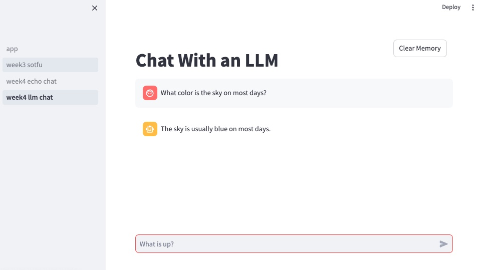

# Week 4

## Learning Objectives

* Connecting to GenAI LLMs
* Langchain basics
* Creating a simple chat loop in Streamlit

## Step 1 - Start a new .env file in the week04 directory

I've made a template file that has the environment variable names we'll use in this week's exercises

```
cp week4env .env
```

edit the .env file to have your keys for various services ready.

## Step 2 - Connect to Hosted Large Language Models

I've made notebooks for you to test your connection to the various LLMs.
I've also made variants to help you connect with LangChain.
You'll need API keys for all of these, which you'll need to configure yourself in your ```.env``` file

### Direct Connection

* [OpenAI](OpenAI_Basics.ipynb)

* [OpenAI Proxy](OpenAIProxy_Basics.ipynb)

* [Azure OpenAI](AzureOpenAI_Basics.ipynb)

* [Google Vertex](GoogleVertex_Basics.ipynb)


### LangChain

* [LangChain OpenAI](OpenAI_LangChain.ipynb)

* [LangChain OpenAI Proxy](OpenAIProxy_LangChain.ipynb)

* [LangChain Azure OpenAI](AzureOpenAI_LangChain.ipynb)

* [LangChain Google Vertex](GoogleVertex_LangChain.ipynb)


## Step 3 - Take the LangChain Quickstart

If you are okay with swiping your credit card with OpenAI, it's not a bad service to have available on demand to test things. The $5 of credit runs out fast.  You can put a limit on how much credit it will allow from a card to prevent accidental overruns.

[LangChain QuickStart](https://python.langchain.com/docs/get_started/quickstart)

Then read the section on Memory

[LangChain Memory](https://python.langchain.com/docs/modules/memory/)

Using AzureOpenAI for the LangChain QuickStart will involve headaches as Azure requires a bunch more deployment-specific setup you may not have available to you readily.

After doing the LangChain Quickstart you may have caught the *bug* and want to learn much more about Prompt engineering than what is in this week's lesson.  For this week we want to make sure you understand

* Prompt Templates
* Simple Conversation Memory Buffers

## Step 4 - Build an Echo Chat with StreamLit

copy over your week3 streamlit app to this folder

```bash
cp -R ../week03/app app
cd app
```

Double check you've copied over the Elasticsearch connection details from week3 to week4's .env file, then launch the app.

```bash
streamlit run app.py
```

Create a new subfodler of ```app``` called ```pages```

In the ```app/pages/``` folder create a new python file called ```week4_echo_chat.py```


We are going to use the chat widgets from [Streamlit Chat elements](https://docs.streamlit.io/library/api-reference/chat)

Add the following to your ```week4_echo_chat.py``` file.  Notice that the chat history rendering is after the human_input so that we update the history on a page redraw before the history is rendered.

```python
import streamlit as st

"# Echo"

#### Define the chat history
## TODO

#### Setup prompt templates and conversation objects
## TODO

## This is what to do when a new human input chat is received
def next_message(human_input):
    print(human_input)

## this is the chat input at the bottom of the page
if human_input := st.chat_input("What is up?"):
    next_message(human_input)

#### Loop through the conversation state and create chat messages
with st.container():
    "### TODO"
    ## TODO


```

Okay!

Let's create a really dumb non-langchain echo bot.

Create a chat history that is just a big array of objects
```python
#### Define the chat history
if "memory" not in st.session_state:
    st.session_state.memory =  []
```

Now every time we get new input add the user's chat and an annoying response from the AI that is just an echo of the same message.
```python
## This is what to do when a new human input chat is received
def next_message(human_input):
    st.session_state.memory.append({"role":"user","message":human_input})
    st.session_state.memory.append({"role":"ai","message":human_input})
```

Last we need to render the chat messages
```python
#### Loop through the conversation state and create chat messages
with st.container():
    for msg in st.session_state.memory:
        with st.chat_message(msg["role"]):
            st.write(msg["message"])
```


## Step 5 - Let's talk to an LLM

Make a copy of the echo chat
```bash
cp pages/week4_echo_chat.py pages/week4_llm_chat.py
```

Pick the LLM LangChain you'd like to chat with from step 2 above and give this page a better title by editing the ```"# Echo``` header at the top of the page

Swap out the memory for a LangChain conversation buffer
```python
#### Define the chat history
if "memory" not in st.session_state:
    st.session_state.memory =  ConversationBufferWindowMemory(k=5)
```

Things will break on the page, but that's okay as we do this retrofit

Change the rendering of chat history

```python
#### Loop through the conversation state and create chat messages
with st.container():
    for message in st.session_state.memory.buffer_as_messages:
        with st.chat_message("user" if message.type == 'human' else 'assistant' ):
            st.markdown(message.content)
```

Now we need to create the Large Language Model itself.  We'll do this in the ```app/resources.py``` file.  Here's an example using OpenAI directly

```python
## put at the top of the page
import openai
from langchain.chat_models import ChatOpenAI
from dotenv import load_dotenv
load_dotenv("../.env", override=True)

## use the @ annotation for a resource so that Streamlit will cache this thing
@st.cache_resource
def load_openai_llm():
    openai.api_key = os.environ["OPENAI_API_KEY"]
    default_model = "gpt-3.5-turbo"
    llm = ChatOpenAI(
        temperature=0.3,
        model=default_model
    )
    return llm
```
Now we are ready to add the LangChain template and conversation. I'll leave it to you to tell the AI who it is with a system message

stick the imports you use at the top of the page
```python
from langchain.chains import ConversationChain
from langchain.prompts.prompt import PromptTemplate
from langchain.memory import ConversationBufferWindowMemory

from resources import load_openai_llm
```

then add the following in the appropriate section I left with a TODO marker
```python
#### Setup prompt templates and conversation objects
TEMPLATE = """TELL THE AI WHO IT IS WITH A SYSTEM MESSAGE

Current conversation:
{history}
Human: {input}
AI:"""

## Create a conversational LLM Chain
if "conversation" not in st.session_state:
    template = TEMPLATE
    PROMPT = PromptTemplate(input_variables=["history", "input"], template=template)
    st.session_state.conversation = ConversationChain(
        prompt=PROMPT,
        llm=load_openai_llm(),
        verbose=True,
        memory=st.session_state.memory,
    )
```

We are almost there! the next step is changing the way human_input is fed into the conversation
```python
## When a new human chat is received
def next_message(human_input):
    st.session_state.conversation.run(human_input)
```

I lied.  Add a button to clear the memory.  Replace the header with the following

```python
col1, col2 = st.columns([4,1])
with col1:
    st.title('YOUR HEADER')
with col2:
    if st.button("Clear Memory"):
        st.session_state.memory.clear()
```


