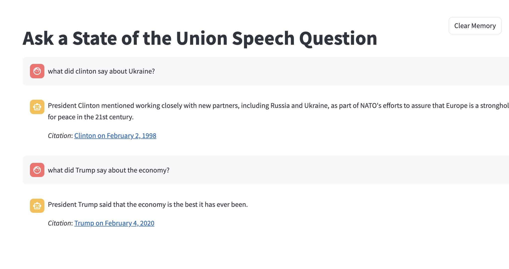

# Week 6

This week we are going to reveal a full RAG example using LangChain.  We'll break it down into smaller parts to understand some of the nuance of what is going on later, but you already have most of the skills and tools to understand what's going on:  deployed models, ingest processors, search queries, and streamlit.

## Learning Objectives

* LangChain - Chunking
* LangChain - ElasticsearchStore
* Retrieval Augmented Generation

## Prepping the week 6 environment

Like always we are going to copy forward what we have from prior weeks

```bash
## make sure your venv is activated
## from the week06 folder
cp -R ../week05/app .
cp -R ../week02/STATE_OF_THE_UNION.pickle .
cp ../week05/.env .
cd app
rm -rf __pycache__
cd ..

```

## Chunking the State of the Union Data


We'll use a Python Notebook to show re-ingesting the State of the Union data for ELSER semantic search

[ELSER the State of the Union](ELSERsotu.ipynb)

## Learning just enough LangChain for RAG

Run the following notebook

[Just enough LangChain for RAG](LangChainForRAG.ipynb)

## Adding a RAG search to our Streamlit app

first let's go into the ```resources.py``` in our streamlit ```app```

at the top of the file where we import python libraries
```python
from langchain.vectorstores.elasticsearch import ElasticsearchStore
```

and then were we have cached resources

```python
@st.cache_resource
def get_es_semantic(index_name):
    es = get_es()
    elastic_vector_search = ElasticsearchStore(
        es_connection=es,
        index_name=index_name,
        strategy=ElasticsearchStore.SparseVectorRetrievalStrategy()
    )
    return elastic_vector_search
```

It's not a pefect app, it could use a lot more polish ... but use my example single-page RAG app but copy the file ```week6_sotu_rag.py``` into your ```app/pages/``` folder and start up the streamlit app to see simple RAG in action.


